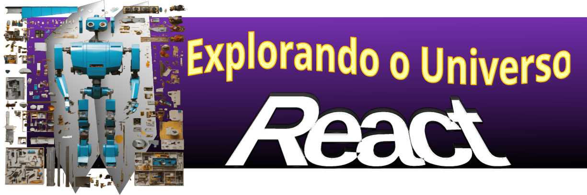

# Desbravando a Hierarquia de Componentes no Desenvolvimento Front-End

## O que são Componentes?

Vamos explorar o fascinante mundo da hierarquia de componentes no desenvolvimento front-end. Componentes são como peças de Lego - pequenas partes que, quando combinadas, formam algo maior e mais incrível. No desenvolvimento web, eles são os blocos de construção da interface do usuário (IU).

## Exemplos de Componentes

### Cabeçalho Reutilizável
Imagine um cabeçalho de página com um logo, um menu e informações. Utilizando componentes, podemos criar um cabeçalho reutilizável em diferentes partes do nosso site, mantendo a consistência visual.

- import React from 'react';

- function Cabecalho() {
-  return (
-     <header>
      
      <nav>
        {/* Links do menu */}
      </nav>
      
Informações importantes

     </header>
  );
 }
-

### Card Flexível
Ao criar uma lista de cards para exibir informações, podemos usar um componente de card flexível. Isso facilita a modificação e reutilização do mesmo design em várias seções do site.

### Formulário Interativo
Um formulário é frequentemente um componente independente. Pode incluir campos de entrada, botões e validação. Reutilizá-lo economiza tempo e mantém a consistência em diferentes partes do aplicativo.

- import React from 'react';

- function Formulario() {
-  // Lógica do formulário
-  return (
-     <form>
-      {/* Campos de entrada e botões */}
-     </form>
-  );
- }

### Construa Sua Própria Hierarquia!
Ao criar uma hierarquia de componentes, você está organizando sua IU de maneira eficiente. Os componentes menores e reutilizáveis podem ser combinados para formar layouts complexos. Lembre-se, é como montar um quebra-cabeça para criar algo grandioso!

### Vamos Conectar!
Curioso sobre este conteúdo? Ele foi gerado por inteligência artificial, mas passou pelo olhar crítico de alguém 100% humano. Se quiser se conectar comigo, me siga no 

### Créditos
- Ilustrações de capas: geradas pela Lexica.Art
- Conteúdo gerado por: ChatGPT e revisões humanas

#ComponentesUI #DesenvolvimentoFrontEnd #WebDevCraftsmanship

